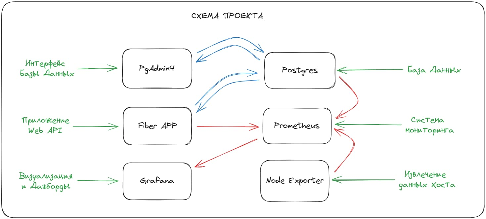
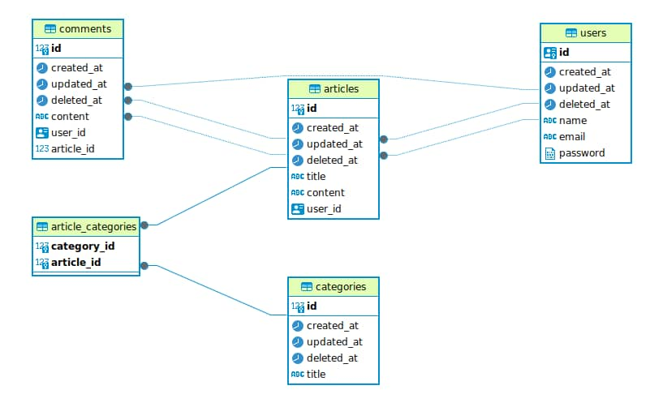
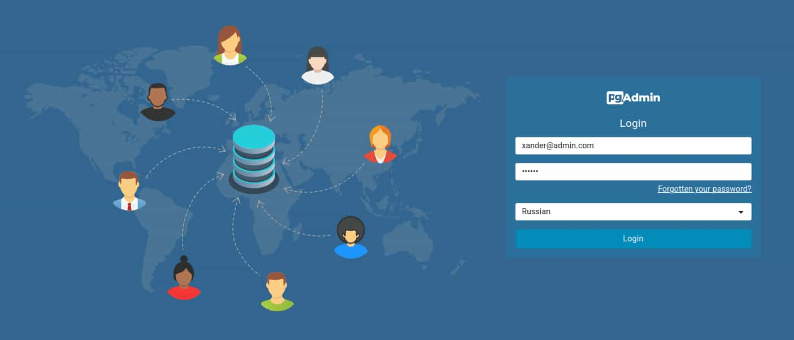
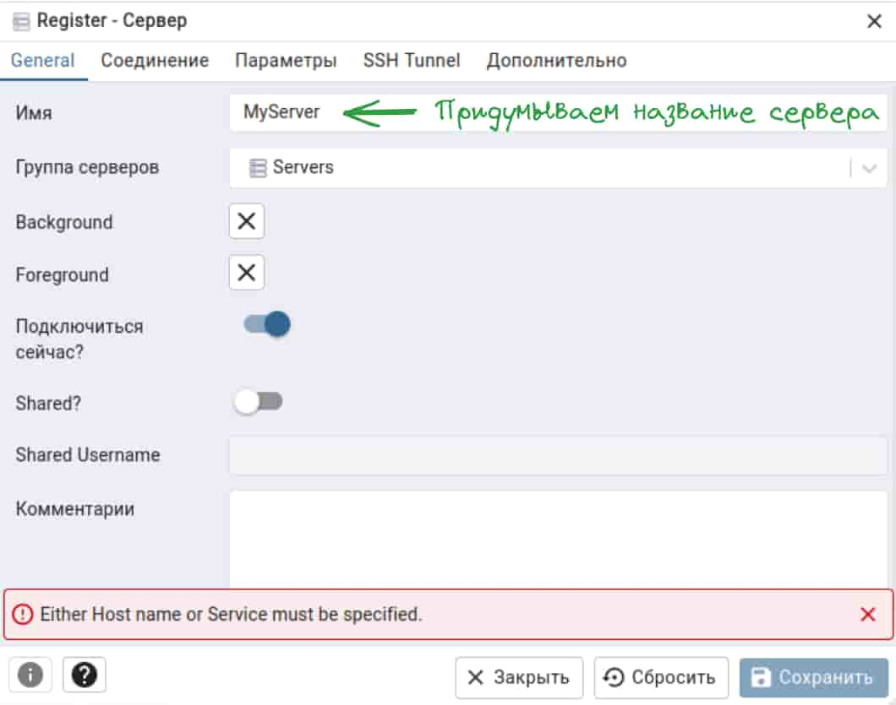
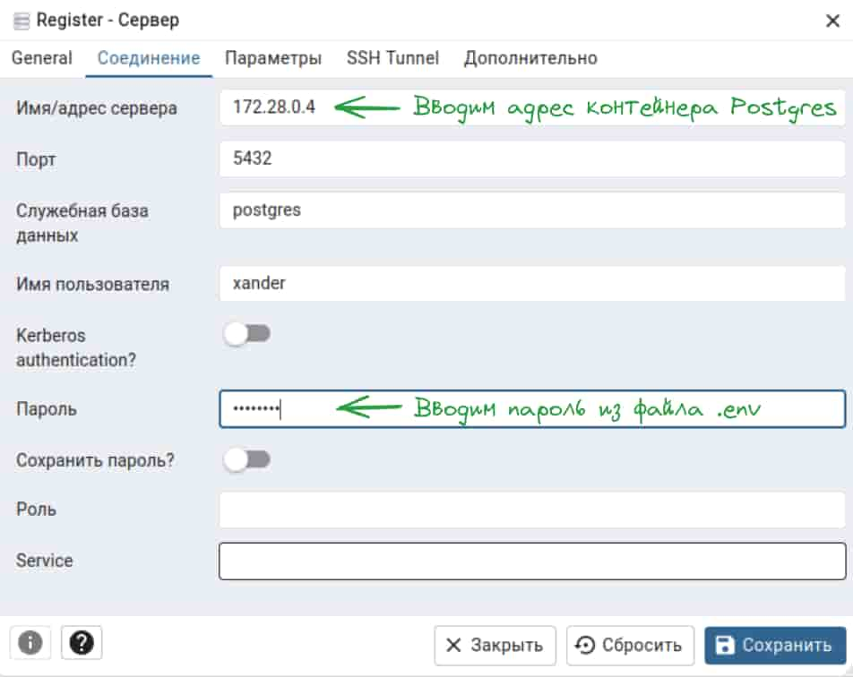
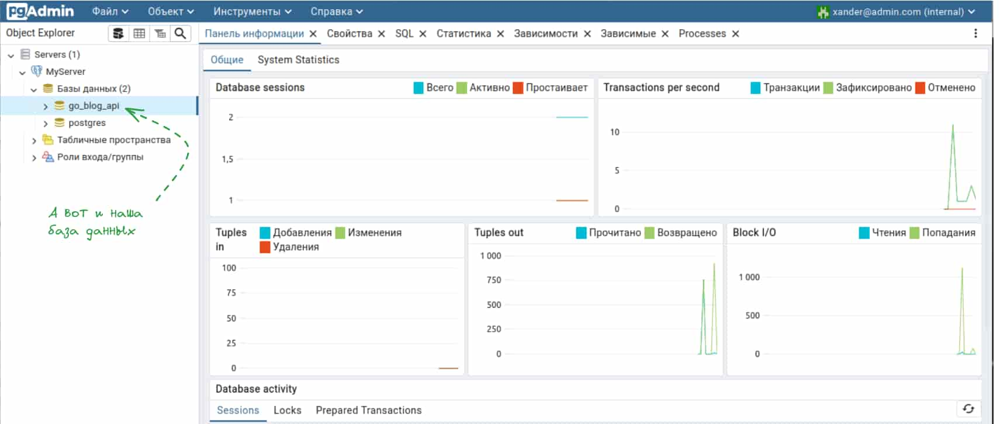
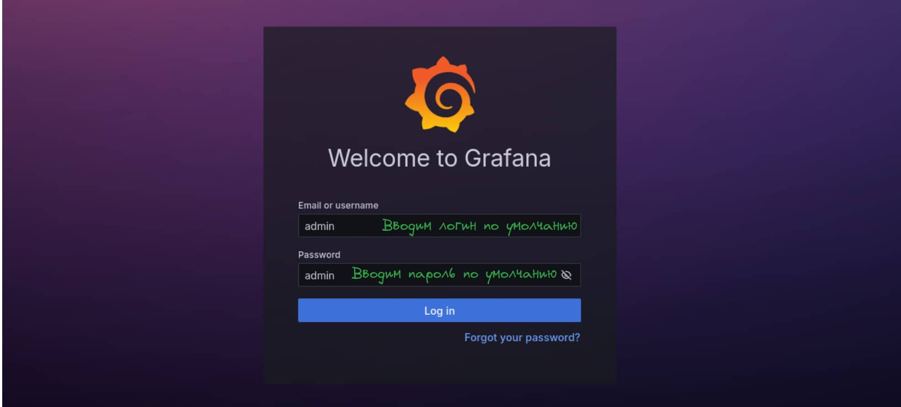

# Go Blog 

Go Blog - готовая основа для быстрой сборки backend-сервисов на основе `Go Fiber`, со необходимой инфраструктурой

  
&nbsp;&nbsp;&nbsp;&nbsp;&nbsp;&nbsp;&nbsp;&nbsp;&nbsp;&nbsp;&nbsp;&nbsp;&nbsp;&nbsp;&nbsp;&nbsp;&nbsp;&nbsp;&nbsp;&nbsp;&nbsp;&nbsp;&nbsp;&nbsp;&nbsp;&nbsp;&nbsp;&nbsp;&nbsp;&nbsp;&nbsp;&nbsp;&nbsp;&nbsp;&nbsp;&nbsp;&nbsp;&nbsp;&nbsp;&nbsp;&nbsp;&nbsp;&nbsp;&nbsp;&nbsp;&nbsp;&nbsp;&nbsp;&nbsp;&nbsp;&nbsp;&nbsp;&nbsp;&nbsp;&nbsp;&nbsp;&nbsp;


[](https://opensource.org/licenses/MIT)

  

## 📋 Table of Contents

  

1. 🌀 [Описание проекта](#what-is-this)
2. 📈 [Краткая документация API](#api_docs)
3. 💾 [База данных](#database_scheme)
4. 🚀 [Инструкция по установке](#installation)
5. ©️ [License](#license)

  

## <a name="what-is-this"> 🌀 Описание проекта</a>

Go Blog - готовая основа для быстрой сборки backend-сервисов на основе `Go Fiber`, Интерфейс API `Swagger`. База данных - `PostgreSQL`. ORM - `GORM`. 
Мониторинг - `Prometheus`. Метрики хоста - `Node Exporter`. Визуализация - `Grafana`. Сборка - `Docker Compose`.



## <a name="api_docs"> 📈 Краткая документация API</a>

Работа с моделями осуществляется по следующим эндпоинтам:


| HTTP Method  | HTTP request               | Description                                       |
| :----------: | :------------------------- | :------------------------------------------------ |
|  [**POST**]  | /api/v1/register           | Регистрация нового пользователя                   |
|  [**POST**]  | /api/v1/login              | Авторизация пользователя про логину и паролю      |
|  [**GET**]   | /api/v1/current_user       | Извлечение авторизованного пользователя по токену |
|  [**GET**]   | /api/v1/logout             | Разлогиниться                                     |
|  [**POST**]  | /categories                | Создать новую категорию                           |
|  [**GET**]   | /categories                | Извлечь все категории                             |
|  [**POST**]  | /categories/add_article    | Добавить статью в категорию                       |
|  [**POST**]  | /categories/remove_article | Удалить статью из категории                       |
|  [**GET**]   | /articles                  | Извлечь все статьи                                |
|  [**POST**]  | /articles                  | Создать новую статью                              |
|  [**GET**]   | /articles/:id              | Извлечь статью по ID                              |
|  [**PUT**]   | /articles/:id              | Обновить статью (только для авторов)              |
| [**DELETE**] | /articles/:id              | Удалить статью (только для авторов)               |
|  [**POST**]  | /article/{id}/add_comment  | Добавить комментарий к статье                     |


## <a name="database_scheme"> 💾 База данных </a>

База данных содержит 5 моделей:

  - **Автор публикации** (User),
  - **Категория статьи** (Category),
  - **Cтатья** (Article),
  - **Статья в категории** (ArticleCategory),
  - **Комментарий** (Comment)
  

<details>

<summary>ДЕТАЛЬНАЯ СХЕМА БАЗЫ ДАННЫХ</summary>

  



  

</details>

  

## <a name="installation"> 🚀 Установка и использование</a>

  

1. ### Подготовка проекта

  

1.1 Клонируете репозиторий

```sh

git clone https://github.com/XanderMoroz/goBlog.git

```

1.2 В корневой папки создаете файл .env

1.3 Заполняете файл .env по следующему шаблону:

```sh

# JWT SETTINGS

JWT_SECRET_KEY="SomeAppSecret"

# POSTGRES SETTINGS
DB_DRIVER=postgres
DB_USER=xander
DB_PASSWORD=password
DB_NAME=go_blog_api
DB_PORT=5432
DB_HOST=go_blog-postgres # С docker
# DB_HOST=127.0.0.1 # Без docker

# POSTGRES TEST SETTINGS
TEST_DB_HOST=go_blog-postgres_test # С docker
# TEST_DB_HOST=127.0.0.1 # Без docker
TEST_DB_DRIVER=postgres
TEST_API_SECRET=some_secret
TEST_DB_USER=xander
TEST_DB_PASSWORD=password
TEST_DB_NAME=go_blog_api_test
TEST_DB_PORT=5432

# PGADMIN SETTINGS
PGADMIN_DEFAULT_EMAIL=xander@admin.com
PGADMIN_DEFAULT_PASSWORD=pwd123

```

2. ### Запуск проекта с Docker compose

2.1 Создаете и запускаете контейнер через терминал:

```sh

sudo docker-compose up --build

```

2.3 Сервисы доступны для эксплуатации:

- Приложение Go `Fiber APP`: http://127.0.0.1:8080/                  
- API + Документация `Swagger`: http://127.0.0.1:8080/swagger/index.html  
- Интерфейс для управления БД Postgres `PGAdmin4`: http://127.0.0.1:5050                    
- Система мониторинга (сбора метрик) `Prometheus`: http://127.0.0.1:9090                  
- Извлекает метрики хоста (cpu-, memory-usage) для мониторинга `Node Exporter`: http://127.0.0.1:9100/              
- Аналитическая система (визиализирует данные в виде дашбордов) `Grafana`: http://127.0.0.1:3000                     


3. ### Дополнительные настройки 

<details>
<summary>Как подключить PGAdmin4 к БД? </summary>


1. Заходим в браузер по адресу http://127.0.0.1:5050 и вводим данные из .env

```bash
PGADMIN_DEFAULT_EMAIL=xander@admin.com
PGADMIN_DEFAULT_PASSWORD=pwd123
```


2. Заполняем Имя сервера (обязательно) 



3. Извлекаем адрес хоста, на котором расположилась БД Postgres

```bash
sudo docker inspect go_blog_postgres | grep IPAddress
```


4. Заполняем Адрес сервера данными хоста БД Postgres и пароль (из файла .env)



6. Готово



</details>


<details>
<summary>Как подключить Grafana к Prometheus? </summary>


1. Заходим в браузер по адресу http://127.0.0.1:3000 и вводим данные по умолчанию:

  - Email or username: admin
  - Password: admin



2. После система потребует придумать новый пароль (это необязательно).


3. Мы авторизованы в сервисе Grafana. Добавим новое подключение...


4. Ищем в списке Prometheus и кликаем по нему


5. Теперь его нужно настроить


7. Извлекаем адрес хоста, на котором расположился Prometheus

```bash
sudo docker inspect prometheus | grep IPAddress
```


8. Заполняем Адрес сервера Prometheus данными хоста 


9. Готово

</details>


<details>
<summary>Как сделать авто-генерацию документации Swagger? </summary>

1. Устанавливаете swag

```sh
go get github.com/swaggo/swag/cmd/swag
```

3.2 Устанавливаете GOPATH

```sh
export PATH=$PATH:$(go env GOPATH)/bin
```

3.3 Генерируете новый вариант документации

```bash
swag init -g main.go
```
</details>


## <a name="license"> ©️ License
